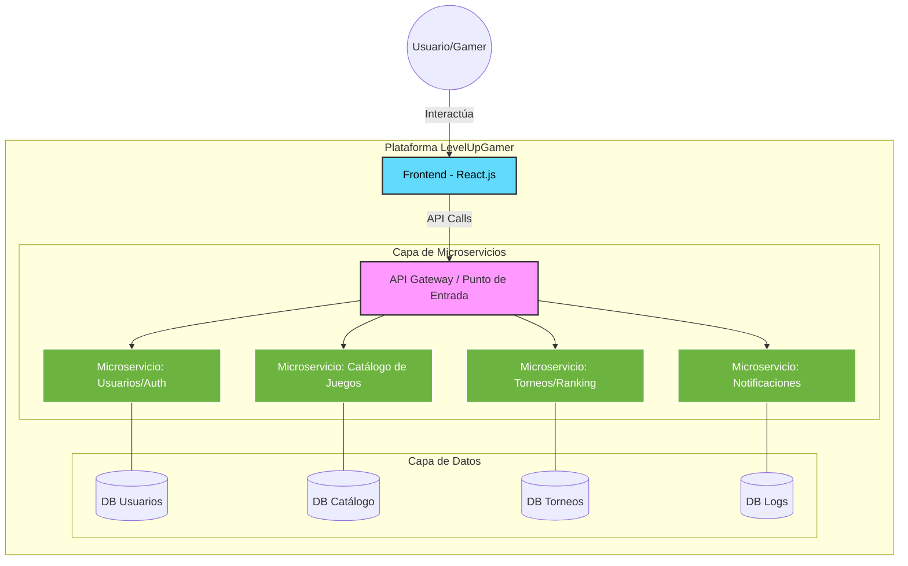

# LevelUpGamer 🎮
### Plataforma de Gestión para Gamers basada en Microservicios

**LevelUpGamer** es una aplicación full-stack diseñada bajo una arquitectura de microservicios, enfocada en [aquí puedes poner el objetivo: ej. gestión de torneos, inventario de juegos o comunidad]. Este proyecto demuestra la integración de múltiples servicios independientes comunicándose entre sí para ofrecer una experiencia escalable.

---

## 🏗️ Arquitectura del Proyecto

El sistema se divide en 5 componentes principales:

1. **Frontend (React):** Interfaz de usuario moderna y responsiva.
2. **Microservicio 1:** [Nombre/Función, ej. Gestión de Usuarios y Auth]
3. **Microservicio 2:** [Nombre/Función, ej. Catálogo de Juegos]
4. **Microservicio 3:** [Nombre/Función, ej. Sistema de Logros]
5. **Microservicio 4:** [Nombre/Función, ej. Pasarela de Pagos/Notificaciones]

## 🛠️ Tecnologías Utilizadas

* **Frontend:** React.js, [Tailwind/Bootstrap], Axios.
* **Backend:** Java 17+, Spring Boot (Spring Security, Spring Data JPA).
* **Base de Datos:** MySQL / PostgreSQL (vía Docker).
* **Herramientas:** Git, GitHub, Postman para pruebas de API.

## 🚀 Instalación y Uso

Para replicar este proyecto localmente, sigue estos pasos:

### Pre-requisitos
* Java JDK 17 o superior.
* Node.js y npm.
* Docker (opcional, para las bases de datos).

### Pasos
1. **Clonar el repositorio:**
   ```bash
   git clone https://github.com/KeitonChaves/LevelUpGamer.git
   ```

2. **Configurar Microservicios:**
Entra en cada carpeta de microservicio y configura el archivo **application.properties** con tus credenciales de base de datos.

3. **Ejecutar el Backend:**
En cada carpeta de microservicio, ejecuta:

```bash
./mvnw spring-boot:run
```

4. **Ejecutar el Frontend:**

```Bash
cd frontend
npm install
npm start
```
### Desarrollado por: Keiton Chaves y Matias Cháves - Analista Programador | Estudiante de Ingeniería en Informática.
---
### Diagrama de Arquitectura

